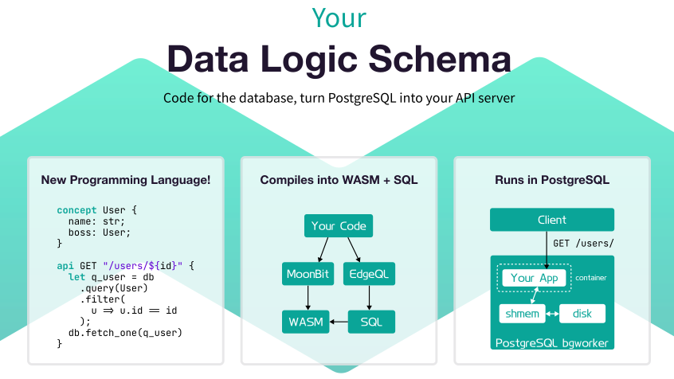

<picture>
  <source srcset="../public/hero-dark.svg" media="(prefers-color-scheme: dark)">
  <source srcset="../public/hero-light.svg" media="(prefers-color-scheme: light)">
  
</picture>

## Rustica Programming Language 

* Declarative, functional programming language inspired by MoonBit and EdgeQL
* Strong static typing, algebraic effect system, ADT and pattern matching
* Language-INtegrated Query (LINQ) eliminates ORM
* Leverages native PostgreSQL types with zero-copy

## Rustica Engine 

* A PostgreSQL extension that runs WebAssembly in bgworkers
* FFI calls to execute prepared statements
* LLVM-powered Ahead-of-Time compilation
* Load-balanced to serve TCP directly from each process

<picture>
  <source srcset="../public/technologies-dark.svg" media="(prefers-color-scheme: dark)">
  <source srcset="../public/technologies-light.svg" media="(prefers-color-scheme: light)">
  
</picture>

