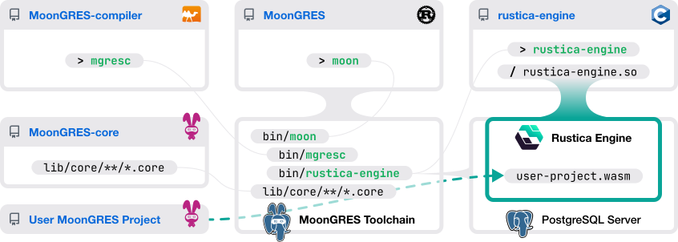

<picture>
  <source srcset="../public/hero-dark.svg" media="(prefers-color-scheme: dark)">
  <source srcset="../public/hero-light.svg" media="(prefers-color-scheme: light)">
  
</picture>

## Rustica Programming Language 

* Declarative, functional programming language inspired by MoonBit and EdgeQL
* Strong static typing, algebraic effect system, ADT and pattern matching
* Language-INtegrated Query (LINQ) eliminates ORM
* Leverages native PostgreSQL types with zero-copy

## Rustica Engine 

* A PostgreSQL extension that runs WebAssembly in bgworkers
* FFI calls to execute prepared statements
* LLVM-powered Ahead-of-Time compilation
* Load-balanced to serve TCP directly from each process

<picture>
  <source srcset="../public/technologies-dark.svg" media="(prefers-color-scheme: dark)">
  <source srcset="../public/technologies-light.svg" media="(prefers-color-scheme: light)">
  
</picture>

---

The Rustica Engine may also work without the Rustica language. As a reference implementation, we give you MoonGRES - an extended MoonBit environment to work with all of the goodies in the Rustica Engine.

<picture>
  
</picture>

## MoonGRES 

Forking from the MoonBit build system and package manager project, MoonGRES itself extends the `moon` command with an extra `moongres` build target, as well as wrapping the Rustica Engine executable to support all the familiar `moon test`, `moon run` workflow. In addition, it provides a new dev-mode that runs a PostgreSQL server with the Rustica extension hassle-free, and watches your MoonBit project to deploy changes, so that you can immediately test your API with those changes.

## MoonGRES-compiler 

In order to compile standard MoonBit code to run with the low-level FFIs exposed by the Rustica Engine, we forked the MoonBit compiler to support all that in a new build target named `moongres`,derived from the `wasm-gc` target.
Underneath, many fundamental data types like `String` and `Bytes` will use native implementation of the PostgreSQL types `text` and `bytea`. However, we tend not to fork the MoonBit language, so that most - if not all - MoonBit code will just run with MoonGRES out of the box.

## MoonGRES-core 

Likewise, this is the MoonGRES fork of the MoonBit standard library. All public APIs should be identical to the upstream, only the implementation is redirected to use the Rustica Engine FFIs under the `moongres` target scope.